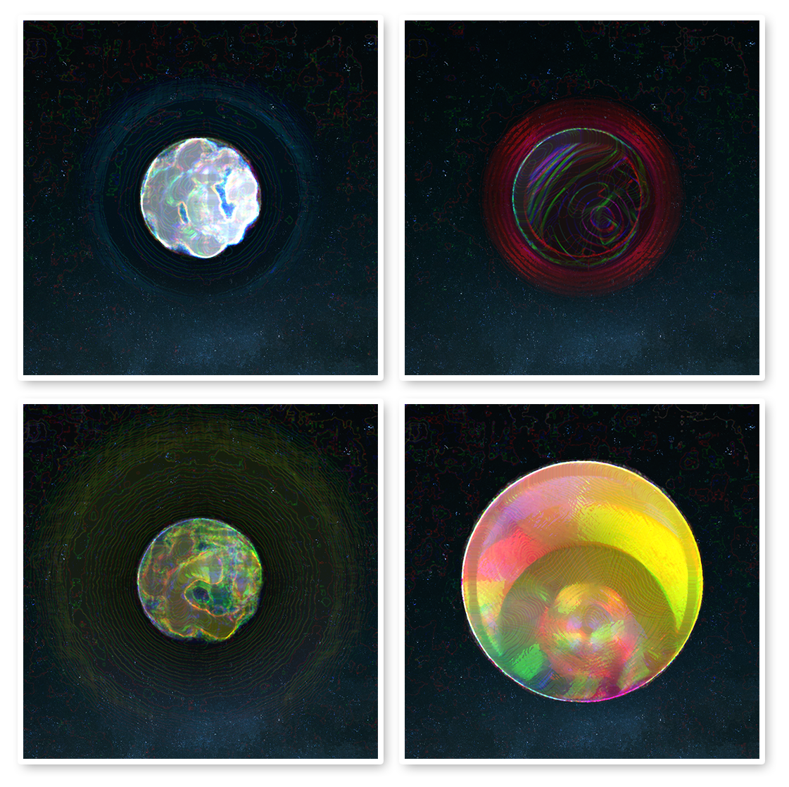

# Cryptospheres

Cryptospheres is a collection of 150 procedurally generated planets that will eventually be minted as NFTs.

## Version 1
I wrote version 1 a pretty long time ago, it was intitially intended to be a social media bot that posted a new planet hourly.
You can find the code for the first one in [this repo](https://github.com/andithemudkip/planet-gen) along with examples of what it can generate.
## Version 2
Version 2 includes some special sauce that makes the planets look **a lot** more artistic and just overall nice imo.

### A couple examples: 

### Overview of techniques used
The images are generated by a script written in Javascript; the main libraries used are node-canvas and Jimp for the actual image generation and tumult for the noise.

The planets are more or less just an amalgamation of gradients masked on top of eachother which gives them a 3D look, even though they are just 2D images drawn on a canvas.

There is a lot of randomness and noise used for a plethora of parameters.

The script firstly generates a random name for each planet which is then used as a seed for the actual planet generation.

## The Gallery
Feel free to check out [The Gallery](./gallery/readme.md) where you can scroll through all 150 planets and see them in all their glory.
