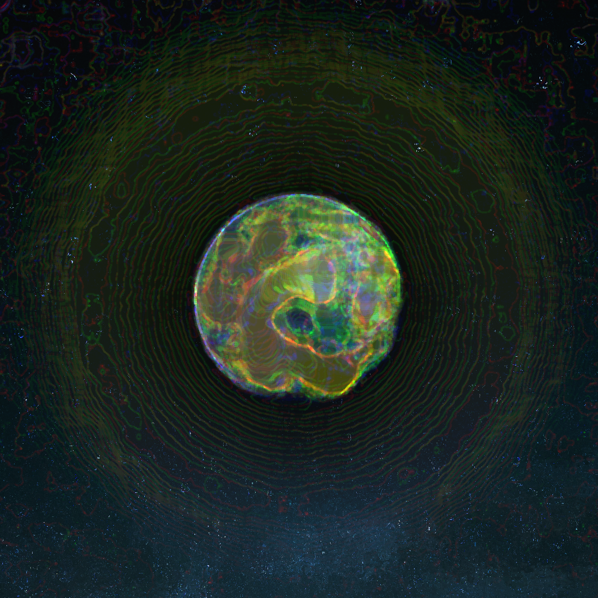
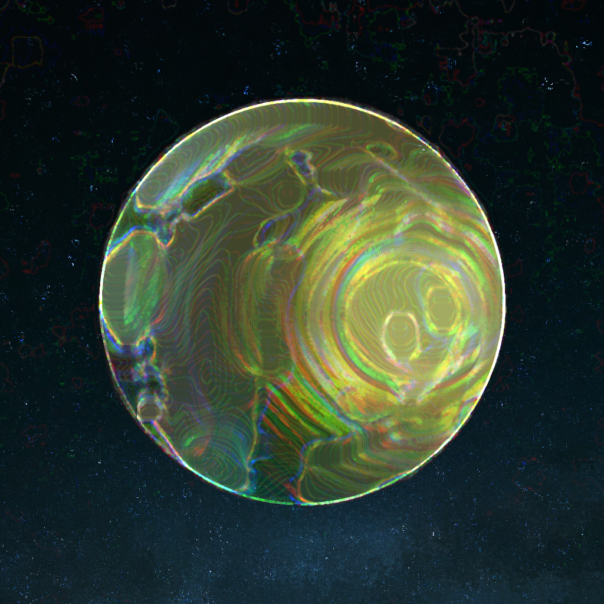
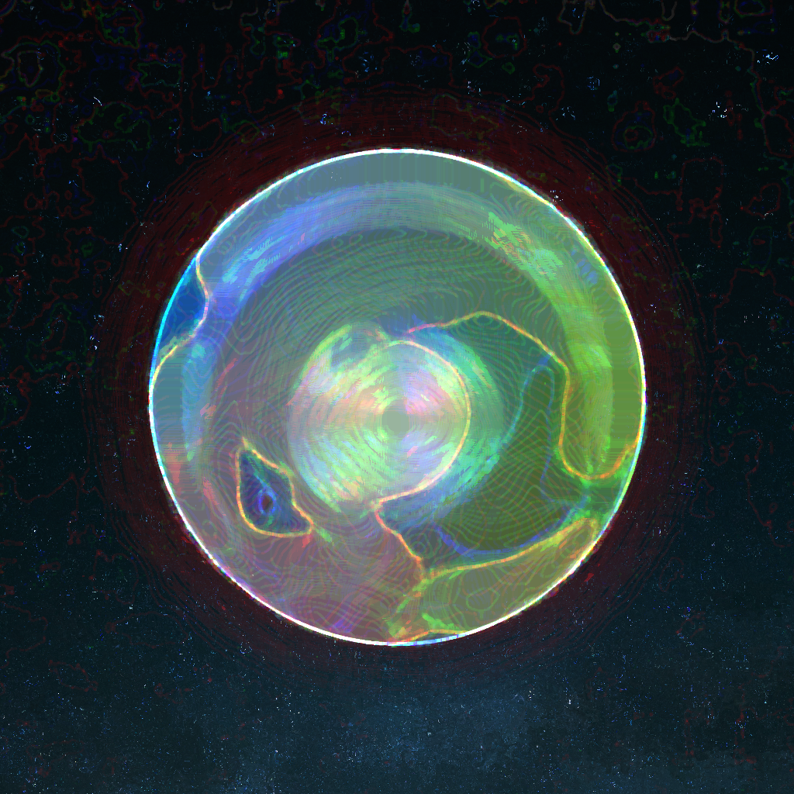
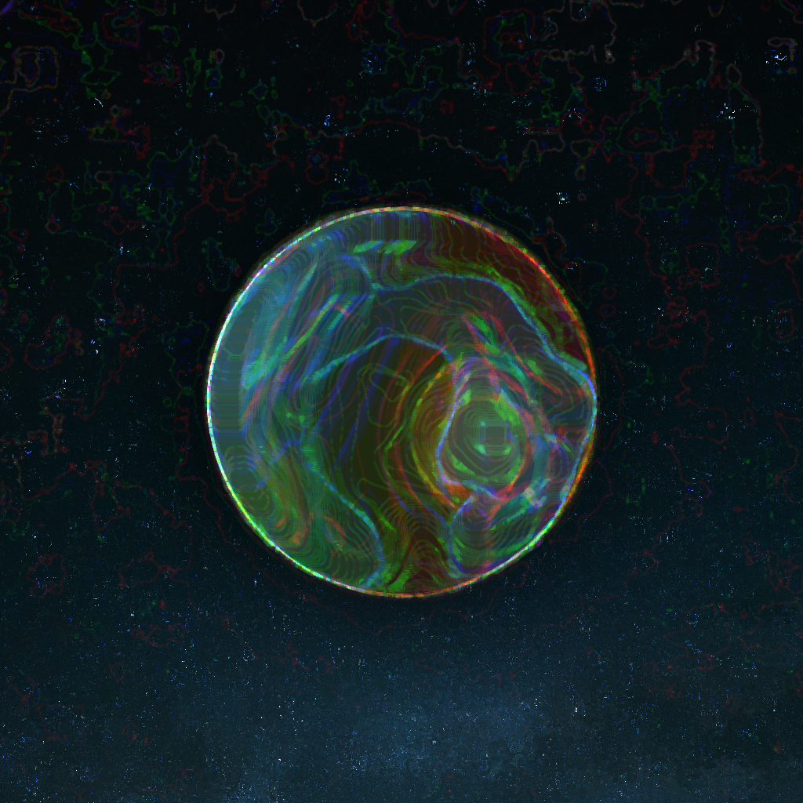
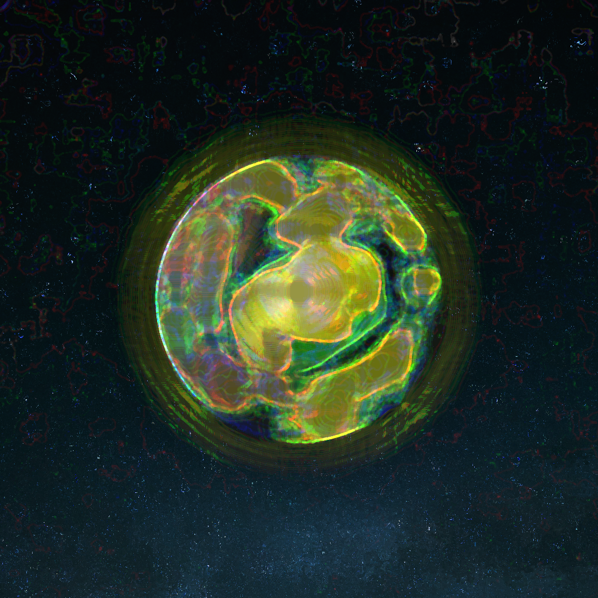
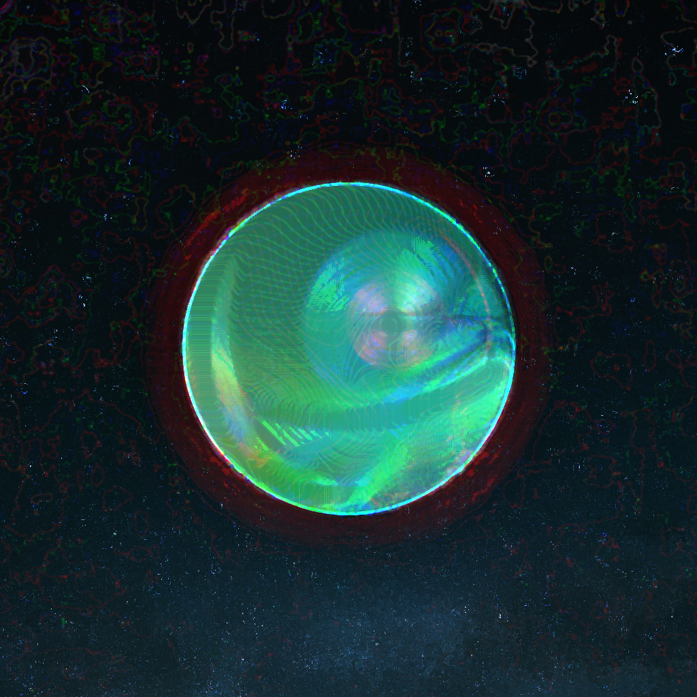

# Gallery

## BADDUS

## BARA-R8P

## BARA

## BERTH

## BILIA

## BILLES-03

## BILLON

## BIPPE-F0K

## BIRI

## BONOE

## BONOE_2

## BORE

## BORIX

## BOV

## BRARA

## BRARS-YX95

## BRARTH

## BRINDA

## BRION

## BRIPPE

## BRORIX

## BROV

## BRYPSO

## CADE-6HHD

## CADUS-99

## CEON

## CHARA

## CHOLLA-DF1

## CIEA-KCC3

## COLLA

## CORE-9Q

## CORE-J1E

## CORIA

## CORTH

## COTH

## CRADUS

## CRERTH

## CRILLES-A61

## CROTH

## CRYKE

## CYKE

## DADE-R0R

## DAO-6W

## DESHAN

## DILIA

## DION-14

## DORE-EDEL

## DOV

## DRILLON-KF

## DRINDA

## DRIRI

## DRYKE

## DRYPSO

## DUNA

## GADUS

## GARVIS

## GERON

## GERTH

## GION

## GIRI

## GNADE-22

## GNARS

## GNILIA

## GNILLON

## GNION-1

## GNION-3

## GNIPPE

## GNIRIA

## GNOLLA

## GNORA

## GRAGUA-VTX

## GRERON-40H

## GRILLON-WOK

## GRORA-ERK2

## GRORE-RQ

## GRUNA

## GUNA

## GYPSO-6AS

## LARA-J9NT

## LARVIS

## LEON

## LLIDES

## LLILIA

## LLION

## LLIRI

## LORA-JA

## LORIA

## LORTH

## LOTH-6A

## LYKE-Y

## LYPSO

## LYRIA

## MADUS

## MILLON

## MORIA-70U3

## MYKE-PE

## NAGUA-Y

## NIRI

## NORIA

## NOV

## NYRIA

## PHAO-I

## PHILLES-AE

## PHION-VMPP

## PHIPPE-87KO

## PHIUQ-69R

## PHORE

## PHORTH

## PHURN

## PHYPSO

## SARTH

## SEON

## SERON

## SION-F51

## SOMIA

## SORIX-DMUL

## STRADE

## STRICHI

## STRILIA

## STRIUQ

## STRORA-1S

## STRORE-CH5

## STRORIX-JDW

## STRORIX

## STROV

## SYRRA

## THAGUA

## THAO

## THICHI

## THOLLA

## THOSIE-80W5

## TRARTH

## TRION-RT

## TROMIA

## TRORIA

## TROTH

## TRYKE

## TRYPSO-31T

## VANOE

## VERON

## VIDES

## VOLLA-Q94

## VOMIA

## ZADUS

## ZERTH-KSJ

## ZERTH-X

## ZESHAN

## ZILLES

## ZION-4R

## ZYRIA

